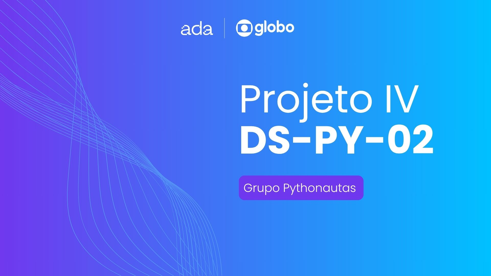
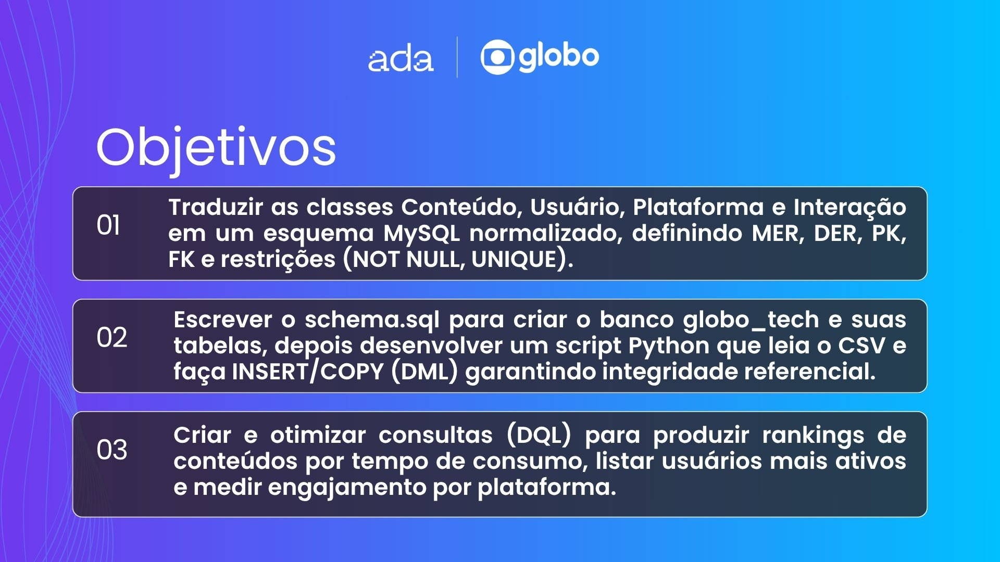
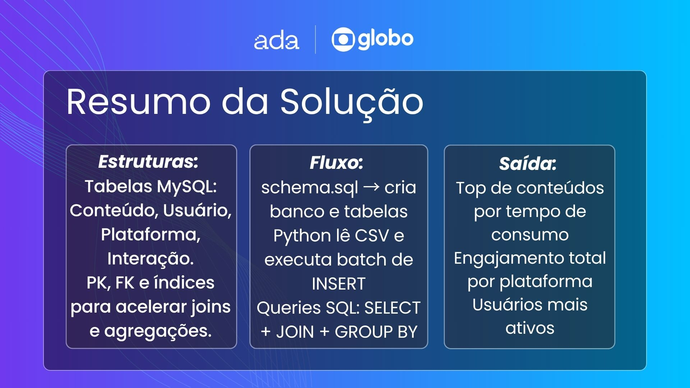
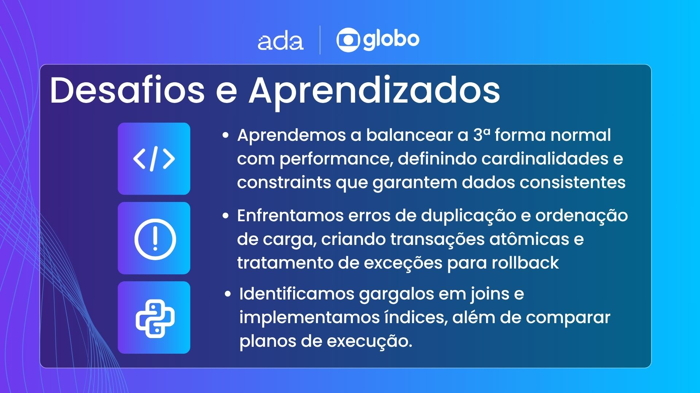
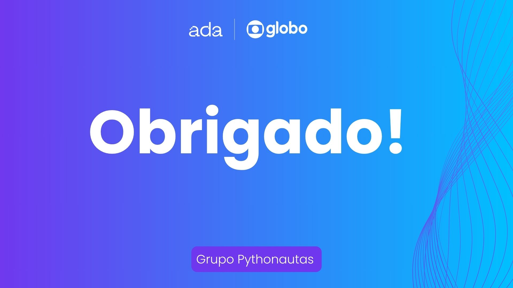

# 🗃️ Ada x Globotech: Projeto Unificado — Fase 4  

## 👥 Integrantes do grupo

- [@falk-dev](https://github.com/falk-dev)
- [@aliceochoa](https://github.com/aliceochoa)
- [@Williannca85](https://github.com/Williannca85)
- [@devrsmenezes](https://github.com/devrsmenezes)
- [@isabelacmaia](https://github.com/isabelacmaia)
- [@ugabiraposo](https://github.com/ugabiraposo)

---

## 📁 Projetos Anteriores

- [Projeto I](https://github.com/falk-dev/projeto-i-ada-globotech)
- [Projeto II](https://github.com/falk-dev/projeto-ii-ada-globotech)
- [Projeto III](https://github.com/falk-dev/projeto-iii-ada-globotech)

---

## 📊 Projeto IV - Persistência e Análise de Engajamento com Banco de Dados Relacional

Este repositório contém a implementação da Fase 4 do Projeto Unificado da Ada Tech, com foco em **banco de dados relacional** e consultas SQL. Após estruturar e processar dados de engajamento de usuários em memória nas fases anteriores, nesta etapa damos um passo importante rumo à **persistência, escalabilidade e robustez**, adotando o **MySQL** como sistema de gerenciamento de dados.

---

## 🎯 Objetivo

- Modelar um banco de dados relacional para armazenar informações de **usuários**, **conteúdos**, **plataformas** e **interações**.
- Criar o esquema do banco com comandos DDL (Data Definition Language).
- Realizar a carga e manipulação de dados com DML (Data Manipulation Language).
- Extrair relatórios e insights por meio de consultas DQL (Data Query Language).

---

## 🧱 Etapas do Projeto

### 1. 📄 Modelagem de Dados

- **MER (Modelo Entidade-Relacionamento)** com as entidades principais:
  - `Usuario`
  - `Conteudo` (e subclasses: `Artigo`, `Podcast`, `Video`)
  - `Plataforma`
  - `Interacao`
- **DER (Modelo Relacional)** com definição de:
  - Tipos de dados SQL
  - Chaves primárias e estrangeiras
  - Cardinalidades
  - Constraints (como `NOT NULL`, `UNIQUE`)

### 2. 🛠️ Criação do Banco (DDL)

- Banco de dados: `globo_tech`
- Script: [`schema.sql`](./schema.sql)
- Tabelas criadas com integridade referencial e restrições apropriadas

### 3. 📥 Carga de Dados (DML)

- Inserção dos dados extraídos do CSV nas tabelas por meio de `INSERT INTO`
- Scripts organizados para popular o banco com dados consistentes

### 4. 📊 Relatórios e Consultas (DQL)

Consultas desenvolvidas em SQL para análises como:

- Ranking de conteúdos mais consumidos (por tempo total de consumo)
- Plataforma com maior engajamento (`like`, `share`, `comment`)
- Lista de conteúdos mais comentados

---

## 🧪 Tecnologias Utilizadas

- MySQL
- Python
- SQL (DDL, DML, DQL)
- Ferramentas de modelagem: draw.io

---

## 📑 Apresentação & Review
Abaixo você encontra os slides que apresentamos durante nossa entrega: os objetivos de aprendizagem, o resumo e a solução proposta, os principais desafios que enfrentamos e, por fim, nossos agradecimentos.

---

## 📝 Observações

Este repositório representa nosso progresso prático na disciplina **DS-PY-02 - Banco de dados**, incluindo modelagem relacional (MER/DER), scripts DDL, carga de dados (DML), consultas DQL e otimização de performance com índices e planos de execução.
